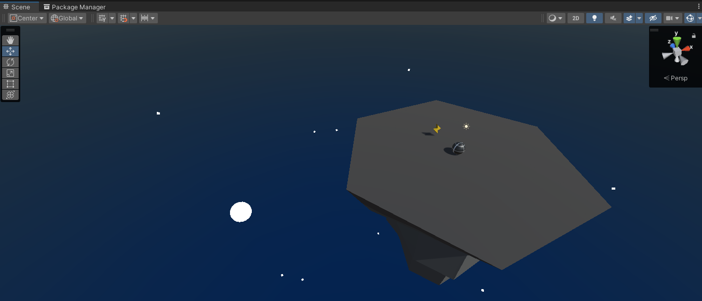

# 🏝️ Unity Island Roller – Powerup & Enemy Waves Challenge

This Unity mini project features a player that rolls like a ball around an island. The camera rotates around the player, and enemies spawn at random locations to chase the player. With each wave, the number of enemies increases and a new power-up spawns. This challenge covers physics, coroutines, vector math, camera control, and game loop management concepts.

---

## 📸 Screenshots

### 🎮 Game View:

### 🛠️ Scene View:

---

## 🎯 Challenge Summary

### 🧠 Core Gameplay:
- The camera rotates around the island based on horizontal input (`Horizontal Input`)
- The player rolls in the direction the camera is facing based on vertical input (`Vertical Input`)
- Enemies spawn at random positions and follow the player
- When the player collects a power-up:
  - A visual effect appears
  - Colliding with enemies launches them away
  - The power effect and visual indicator disappear after a short time
- Enemies spawn in waves, with more spawning each time
- A new power-up appears at the start of each wave

---

## 🧱 Technical Components

### 🎥 Camera & Movement
- The camera is a child of an empty object to orbit around the player
- Movement direction is calculated using global and local coordinates
- The player moves in the direction the camera is facing

### 🧲 Physics & Interactions
- Balls (player and enemies) use physics materials for bouncing effects
- `Vector3` is used to define directions, normalized to keep consistent speed
- Custom methods like `GetDirectionToTarget()` are used to determine direction

### 💥 Power-Up Mechanics
- A visual indicator is activated when a power-up is collected (`SetActive(true)`)
- While powered up, enemies are launched away on contact (`AddForce`)
- Coroutines (`IEnumerator`, `WaitForSeconds`) control power-up duration
- `SetActive(false)` deactivates the visual effect after power ends

### 🧟‍♂️ Enemy & Wave System
- Enemies spawn at random positions at the beginning of each wave
- A `for` loop is used to increase the enemy count per wave (`++`)
- `FindObjectsOfType<Enemy>()` is used to count live enemies
- When all enemies are defeated, a new wave starts and spawns a new power-up

---

## 🧠 Concepts Learned

| Concept                      | Usage                                                        |
|------------------------------|---------------------------------------------------------------|
| Camera Parenting             | Setting up camera to orbit the island                        |
| Texture Wrapping             | Creating seamless repeating floor textures                   |
| Vector3 & Normalize          | Used in movement and force calculations                      |
| Rigidbody & Physics Material | Bouncing and realistic rolling behavior                      |
| Coroutines & WaitForSeconds  | Managing timed power-up effects                              |
| `SetActive()`                | Toggling visual power-up indicators                          |
| `FindObjectsOfType`          | Counting active enemies in the scene                         |
| Custom Methods with Return   | Returning directional vectors                                |
| `Debug.Log("Score: " + x)`   | Displaying debug information using string concatenation      |

---

## 📁 Project Folder Structure
